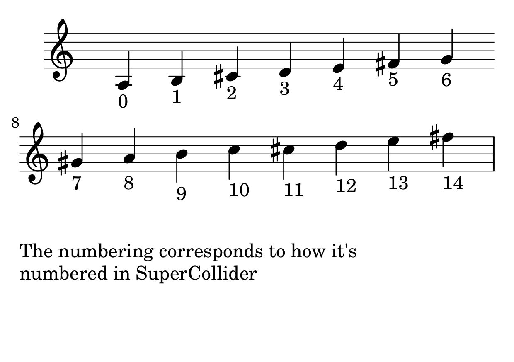
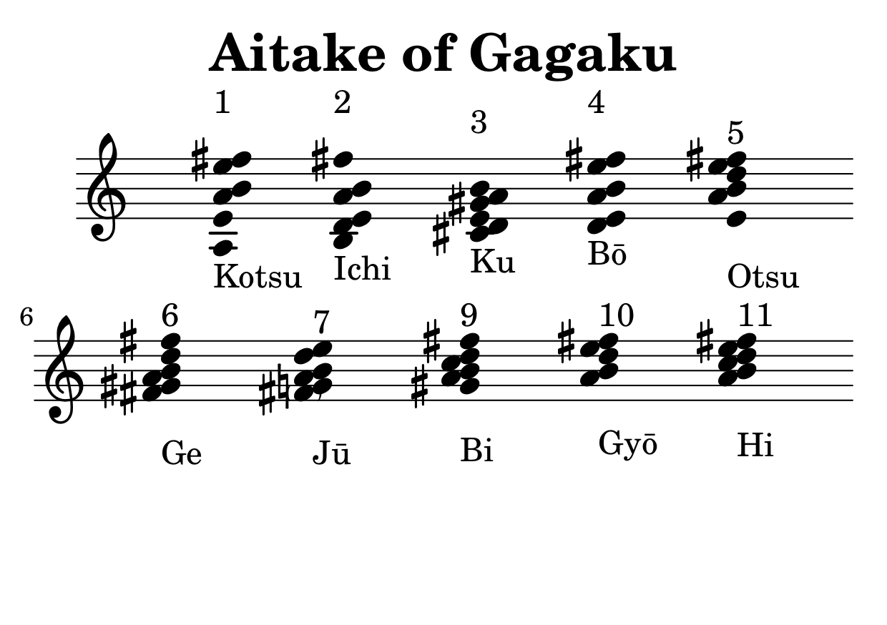

# MH-Shō

An adaptation of the Japanese mouth-organ Shō (笙) in `SuperCollider`. 

## Installation

Clone this repository into you `sclang-extensions-dir`.

On MacOs:


``` sh
$ cd ~/Library/Application\ Support/SuperColldier/Extensions
$ git clone https://github.com/mattiashallsten/mh-sho
```

Then re-compile SuperCollider.

## The reeds
There are 15 playable reeds of fixed pitch, and form the following scale:



## The aitake (合竹)
There are 11 _aitake_ in total, as well as number seven (Jū) being featured twice due to it having one version with the note F# and one without -- these two versions are named `ju` and `ju_II` in SuperCollider.

Here are the aitake:



## The te-utsuri
Moving between the _aitake_ different _te-utsuri_ are used. These are fixed and known by every Shō player. 

## Usage

Is described in detail in the help documentation. Basically:

``` sclang
s.boot;

x = MHSho(root: 500, tempo: 1, numPartials: 8);

x.aitake_(\ichi);

x.teutsuri(\kotsu);
```

# MHShoMIDI

A subclass to `MHSho`. With it, the user can define a midi output and send the notes of the _aitake_ there instead of the synth in SuperCollider.

# Bugs and TODO
- [ ] Make it possible to split the outputs, so that I get 15 rather than 1 mono
      track. Should be straight-forward.

- [x] Implement a function that waits for the approximate time it takes for the
      piano sound to fade out, setting the `isPlaying` parameter to `false`.

- [ ] The `teutsuri` method isn't really working for MIDI output. I have to look
      more into detail how I wrote the method in the `MHSho` class.

- [ ] After the `prActionTimer` routine is done, the gate is not set to 0 as it
      should.
	  
I have a hard time figuring out why the `teutsuri` method is not doing what it should be doing. It seems as though the rhythms get qunatized for some reason, the smaller 16th notes are not at all as apparent.
